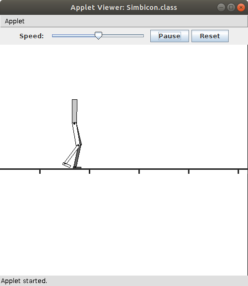
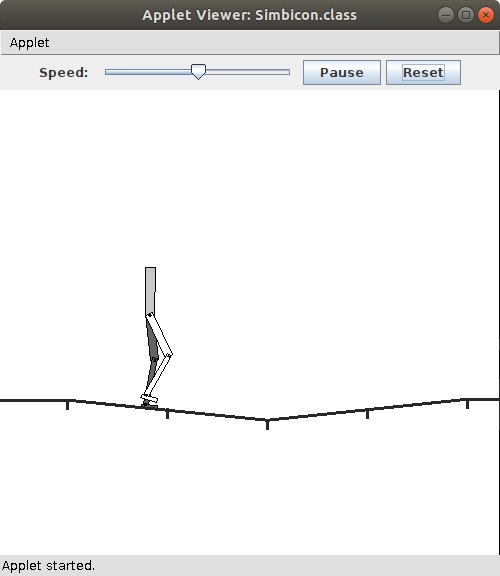
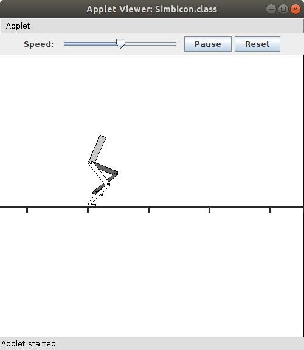

# JSimbicon #

 <!-- allowed_elements ["
", "", " "] -->

 

| JSimbicon - walking, flat ground | JSimbicon - walking, uneven ground | JSimbicon - crouch walk, flat ground  |
| -------------------------------- | ---------------------------------- | ----------------------------------- |
|  |  |  |
| 'w' key pressed | '2' key pressed | 'c' key pressed |

 
 

A Java Applet implementation of *SIMBICON: Simple Biped Locomotion Control* for a planar 7-link biped as documented in the published article and supplemental material provided at reference link \[[1](https://doi.org/10.1145/1276377.1276509)]. The **JSimbicon** Java Applet source files and HTML launch script were extracted from the downloadable archive file available using the *JSIMBCON Java code (JSimbicon.zip)* link on the *Simbicon Project Webpage* given as reference link \[[2](https://www.cs.ubc.ca/~van/papers/Simbicon.htm)].

## Build and Run ##

On an Ubuntu 18.0 LTS platform, the **JSimbicon** source code files can be compiled into Java class files with the JavaSE-1.8 compatible **javac** compiler provided in the OpenJDK 8 Development Kit (JDK) package. Since most current web browsers are incapable of executing Java Applets, the **JSimbicon** applet must be executed on the local JVM platform using **appletviewer** bundled with OpenJDK packages no newer than JavaSE-1.8. The availability of **appletviewer** requiring an install of OpenJDK-8, possibly concurrently with a newer OpenJDK version installed (i.e., OpenJDK-11), necessitates setting the JVM runtime library and binary paths appropriately to JavaSE-1.8 before compiling **JSimbicon** and subsequently invoking **appletviewer** to debug and/or run the **JSimbicon** applet.

Note: A mouse click within the **JBsimbicon** applet window must occur before any key presses will be recognized by the applet.

### From Visual Studio Code IDE ###

Visual Studio Code (VS Code) IDE settings and tasks JSON configuation files (`settings.json` and `tasks.json` respectively) are provided to enable compiling, debugging and running the **JSimbicon** applet from within the VS Code IDE. Directory paths in both JSON configuration files may need to be modified to reflect the appropriate paths to JavaSE-1.8 runtime libraries and binaries of OpenJDK-8 package installed by the Linux distribution variant/version running on the local JVM platform. Additionally, the Linux integrated terminal environment PATH variable in `settings.json` must reflect the user's home directory.

When debugging the **JSimbicon** applet from within VS Code IDE by running Terminal "appletviewer debug" task, it's assumed the current working directory is that containing the Java debugger (**jdb**) initialization `jdb.ini` file.

### From Command Shell Terminal ###

The following table describes shell scripts which are provided to compile, debug and run the **JSimbicon** applet from a command shell terminal.

| Script File | Description                                                                         |
| :---------- | :---------------------------------------------------------------------------------- |
| `jvc_simbicon.sh` | Creates `./classes` subdirectory as needed, then compiles `./src/*.java` files and places resultant `*.class` files into `./classes` subdirectory. |
| `jdb_simbicon.sh` | Invokes **appletviewer** with '-debug' option to launch **JSimbicon** using HTML \<applet> tag in `Simbicon.html` file and initializes **jdb** debugging with commands in `jdb.ini` file. |
| `run_simbicon.sh` | Invokes **appletviewer** to launch **JSimbicon** using HTML \<applet> tag in `Simbicon.html` file. |

Utilizing `jvc_simbicon.sh`, `jdb_simbicon.sh` or `run_simbicon.sh` scripts to compile, debug or run **JSimbicon** presumes the enviroment variable `JAVA8_HOME` has been previously set, such as within the user's ~/.bashrc file. The `JAVA8_HOME` path is that of the installed OpenJDK-8 directory which contains `./bin` , `./jre` and `./lib` subdirectories.

## References ##

| Link | Document |
| ---- | :------- |
| \[[1](https://doi.org/10.1145/1276377.1276509)] | KangKang Yin, Kevin Loken, Michiel van de Panne; *SIMBICON: Simple Biped Locomotion Control*; ACM Transactions on Graphics, Volume 26, Issue 3, 29 July 2007, pp 105-es; <https://doi.org/10.1145/1276377.1276509> |
| \[[2](https://www.cs.ubc.ca/~van/papers/Simbicon.htm)] | *Simbicon Project Webpage*; <https://www.cs.ubc.ca/~van/papers/Simbicon.htm> |
